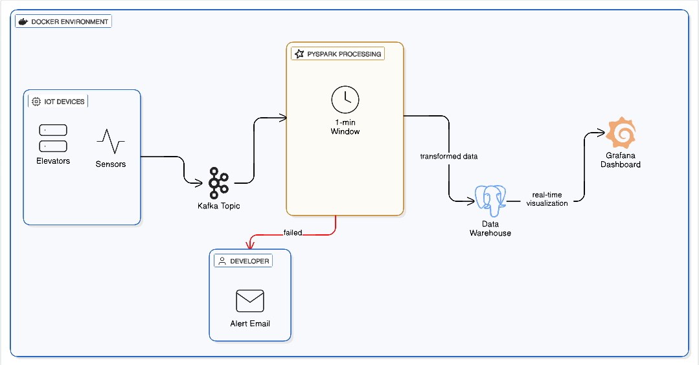
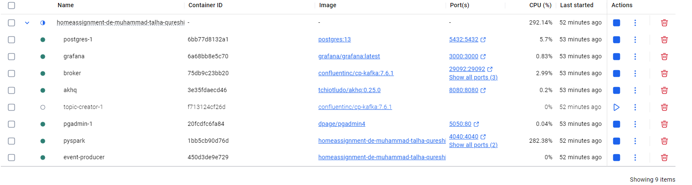
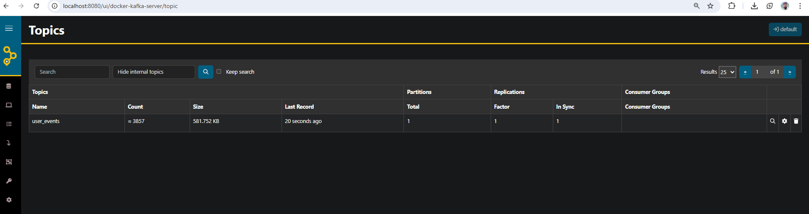
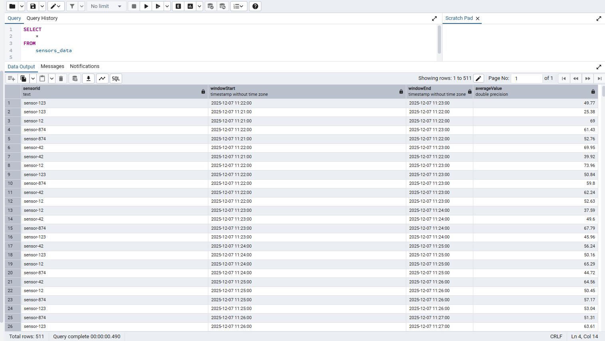
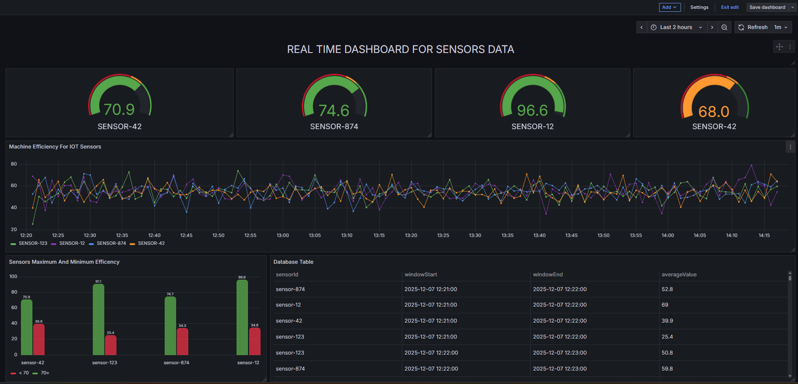

# Lottery Events Data Streaming Pipeline

Real-time lottery data streaming pipeline using **PySpark Structured Streaming** , **Kafka**,**Postgres** and **Grafana**.

## Overview

This project ingests user events data from a Kafka topic, performs real-time aggregation, and writes the results to postgres DB and visualize it in Grafana.

**Features:**

- Reads sensor data from Kafka topic: `user-events`
- Aggregates sensor readings in **1-minute windows**
- Computes the **Event Count** for each lottery per event type
- Writes aggregated results to PostgresDB: `lottery_db`
- Supports unit testing for transformations
- Modular design with separate transformation and sink modules
- On pipeline failure, an automatic email with the error will be sent. Configure credentials in the .env file

---

## Architecture

Kafka : To persist the incoming streaming messages and deliver to spark application

Spark: Structured Streaming to process the data from kafka, aggregating data using Data Frames. (Spark-SQL).

Spark Structured Steaming API: For writing out the data streams to DB like PostgresDB.



## Prepare your development environment

- Install Docker in your local machine
- Run Kafka and Kafka Producer

Go to the current project directory and run the following command in your terminal.

```
docker-compose up --build

```

- Wait for 2-3 minutes until all of the docker containers are running.
- Then click on pyspark container and go to logs and click on the link starting with http://127.0.0.1:8888/
  
- After clicking the link the jupyter lab will be opened

## Running Test for Pyspark datapipeline

- Open a terminal from jupyter lab UI
- Change the dir to /home/jovyan/work/src
- Run this command to unittest data pipeline

```
python -m pytest tests/ -v

```

## Running Pyspark datapipeline

- Open a terminal from jupyter lab UI
- Make sure you are in this dir /home/jovyan/work
- Run this command to start the pyspark job for ingesting real time data and out the aggregated events to sensor-output topic

```
spark-submit --master local[*] --packages org.apache.spark:spark-sql-kafka-0-10_2.12:3.5.1,org.postgresql:postgresql:42.7.3 src/main.py

```

## Checking the output

### Kafka Output

- Check the Kafka UI at http://localhost:8080/ui/docker-kafka-server/topic
- user_events have the input data
  

# pgAdmin & PostgreSQL Setup Guide

## Step 1: Log in to pgAdmin

1. Go to the pgAdmin URL:  
   Typically: `http://localhost:5050` (or the port you exposed in your Docker setup).
2. Log in with the pgAdmin Client credentials:
   - **Email Address (ID):** `admin@admin.com`
   - **Password:** `admin`

---

## Step 2: Connect to the PostgreSQL Server

After logging into pgAdmin, register a new server connection to your PostgreSQL database:

1. Right-click on **Servers** → **Create** → **Server...**
2. **General Tab:**
   - Give the server a descriptive name (e.g., `Lottery_Postgres_Server`).
3. **Connection Tab:** Use the following configuration:
   - **Host Name/Address:** `postgres`
     > Note: If you are running pgAdmin on your host machine (not inside Docker), you may need to use `localhost` or your Docker host's IP instead of `postgres`.
   - **Port:** `5432`
   - **Maintenance database:** `lottery_db`
     > Or `postgres` if `lottery_db` hasn't been created yet by Spark.
   - **Username:** `admin`
   - **Password:** `admin`
4. Click **Save** to establish the server connection.

---

## Step 3: View the Aggregated Data

1. In the pgAdmin browser tree:
   - Expand the server you just created (e.g., `Lottery_Postgres_Server`).
   - Expand **Databases → lottery_db**.
   - Expand **Schemas → public → Tables**.
2. Locate the table named `lottery_aggregates`.
3. Right-click on `lottery_aggregates` and select **View/Edit Data → All Rows**
   - This executes a query to view the real-time aggregated output saved by your Spark Streaming job.



# Grafana Dashboard Access Guide

## Step 1: Open the Dashboard

The Grafana dashboard is already running. Open the following URL in your browser:

```
http://localhost:3000

```

- **Username:** `admin`
- **Password:** `admin` (default, may prompt to reset on first login)

---

## Step 2: Connect Grafana to PostgreSQL

1. In Grafana, go to **Configuration → Data Sources → Add data source → PostgreSQL**.
2. Enter the following connection details:
   - **Host:** `postgres:5432`
     > Use `localhost:5432` if connecting from your host machine.
   - **Database:** `lottery_db`
   - **User:** `admin`
   - **Password:** `admin`
   - **SSL Mode:** `disable` (for local development)
3. Click **Save & Test** to confirm the connection.

Once connected, the dashboard will show your real-time aggregated data from Spark Streaming on the below link

```
http://localhost:3000/d/adxsnwq/lotto24?orgId=1&from=2025-10-28T08:29:00.000Z&to=2025-10-28T09:37:00.000Z&timezone=browser&refresh=1m

```


